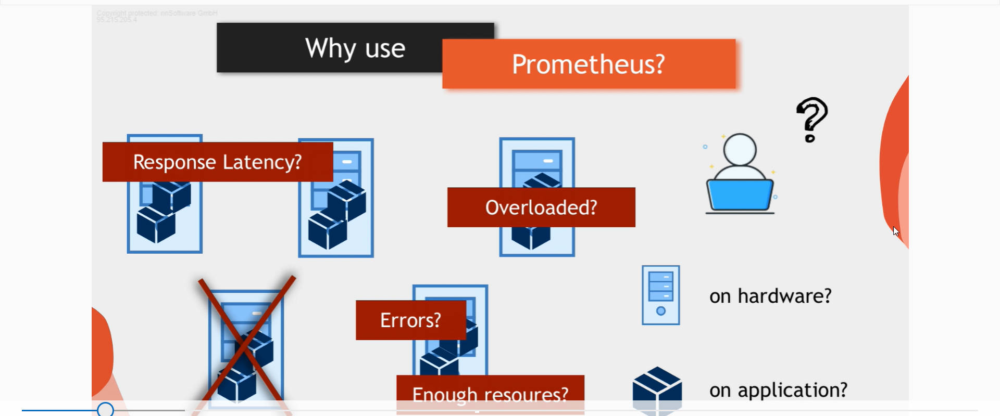

# Prometheus
## **Monitoring-with-Prometheus**
- **Introduction to Prometheus Monitoring** 
- **What is prometheus**
- **Where and why is prometheus used?**
- **Prometheus architecture**
- **Example configuration**
- **Key characteristics**

## **What is prometheus?**
Prometheus is a monitoring tool that was created to monitor highly dynamic container environment- like kubenetes, docker swam, etc. It can also be used in traditional non-container (bare server) infrastructure- where you have bare servers with application deployed directly on them.

***at a high level, prometheus offers monitoring and alerting capabilities to effectively manage DevOps workflow***

over the past years, prometheus has become the main stream monitoring tool of choice in containers and micro-service infrastructur.

## **Why use prometheus**
Modern day DevOps is becoming more and more complex to handle manually and therefore needs more automation. Typically you have multiple servers that run multiple containerised applications and there are 100's of different processes running on that infrastructure and things are interconnected.

Maintaining such setups to run smoothly without application downtime can be very challenging.
Imagine having such a complex archtecture with loads of servers distributed accross different locations and you have no insight of what is happening on hardware level or application level like;
- erros
- response latency
- hardware down
- server overload and running out of resource

Prometheus makes searching problem more efficient through constantly 
- monitoring whether services are running, 
- alerts maintainers as soon as a service crashes,
- identifies problems before they even occure by allerting systems administrators responsible for that infrastructure so they can quickly look into the root cause of what could cause the system to fail.

Prometheus as a monitoring tool checks
1. checks memory usage on each server; to see if the server is running out of memory.
2. suddenly you stop seeing logs for your application because elasticsearch doesnt accept any new logs because the server ran out of disk space or elasticsearch ran out of disk space that was allocated to it.
3. In a thightly coupled architecture, a service might experience an unusual load or spike in traffic which might cause it  break or slow down and starts sending error messages to all other services that are tightly coupled to architecture, thereby causing the entire architecture to break or slow down. 

## Prometheus Architecture
**How does prometheus work?**

At it's core, prometheus has it's main component called ***`prometheus server`***. that does the actual work. 
it is made up of three part

1. **`Data Retrieval Worker:`** this is responsible for getting or pulling metrics data from applications, services, servers or other target resources and stores them in the time series database

2. **`Time Series Database`**: It stores all the matric data- like current CPU usage, number of exceptions in an application.

3. **`Web Server (HTTP Server API)`:** that accepts queries for that stored data. The web server component or server API is used to display the data in a dashboard or UI either through prometheus dashboard `(prometheus Web UI)` or any other data visualization tool like ***`Grafana`***  

### What does the prometheus tool monitor?
The prometheus server can monitor anything.
that could be anything such as 

- An entire Linux server
- An entire Windows server.
- A single application or service like a database

***`these things that prometheus monitors are called targets.`***

Each targets has units of monitoring. For a linux server target, it could be a;
-  current CPU status
- Its memory usage
- disk space usage.

For an application, these targets could be;
- number of exceptions
- number of requests.
- request count
- request duration

***`The unit you would like to monitor for a specific target is called a metric.`***

these matrics are what get saved in prometheus database component (Time series Database). 

prometheus then defines human readable, text based format for this metrics. metrics have types and attributes to increase it's readability.

