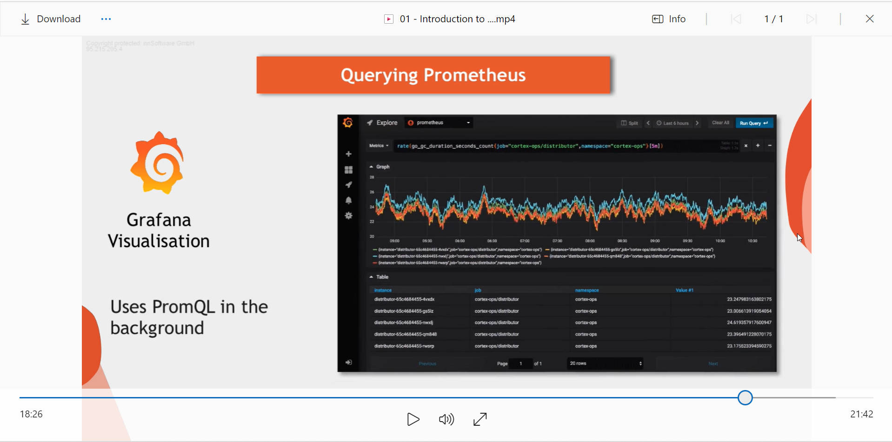
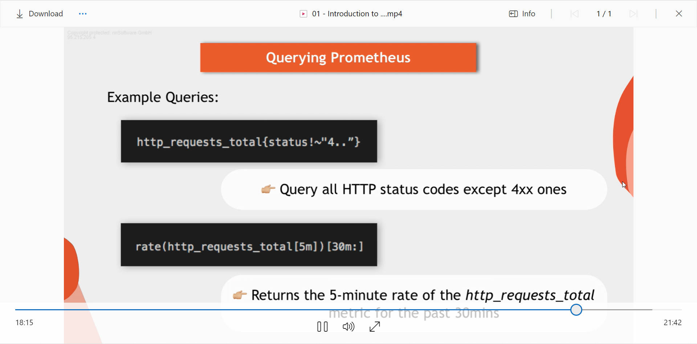

# Prometheus
## **Monitoring-with-Prometheus**
- **Introduction to Prometheus Monitoring** 
- **What is prometheus**
- **Where and why is prometheus used?**
- **Prometheus architecture**
- **Example configuration**
- **Key characteristics**

## **What is prometheus?**
Prometheus is a monitoring tool that was created to monitor highly dynamic container environment- like kubenetes, docker swam, etc. It can also be used in traditional non-container (bare server) infrastructure- where you have bare servers with application deployed directly on them.

***at a high level, prometheus offers monitoring and alerting capabilities to effectively manage DevOps workflow***

over the past years, prometheus has become the main stream monitoring tool of choice in containers and micro-service infrastructur.

## **Why use prometheus**
Modern day DevOps is becoming more and more complex to handle manually and therefore needs more automation. Typically you have multiple servers that run multiple containerised applications and there are 100's of different processes running on that infrastructure and things are interconnected.

Maintaining such setups to run smoothly without application downtime can be very challenging.
Imagine having such a complex archtecture with loads of servers distributed accross different locations and you have no insight of what is happening on hardware level or application level like;
- erros
- response latency
- hardware down
- server overload and running out of resource

Prometheus makes searching problem more efficient through constantly 
- monitoring whether services are running, 
- alerts maintainers as soon as a service crashes,
- identifies problems before they even occure by allerting systems administrators responsible for that infrastructure so they can quickly look into the root cause of what could cause the system to fail.

Prometheus as a monitoring tool checks
1. checks memory usage on each server; to see if the server is running out of memory.
2. suddenly you stop seeing logs for your application because elasticsearch doesnt accept any new logs because the server ran out of disk space or elasticsearch ran out of disk space that was allocated to it.
3. In a thightly coupled architecture, a service might experience an unusual load or spike in traffic which might cause it  break or slow down and starts sending error messages to all other services that are tightly coupled to architecture, thereby causing the entire architecture to break or slow down. 

## Prometheus Architecture
**How does prometheus work?**

At it's core, prometheus has it's main component called ***`prometheus server`***. that does the actual work. 
it is made up of three part

1. **`Data Retrieval Worker:`** this is responsible for getting or pulling metrics data from applications, services, servers or other target resources and stores them in the time series database

2. **`Time Series Database`**: It stores all the matric data- like current CPU usage, number of exceptions in an application.

3. **`Web Server (HTTP Server API)`:** that accepts queries for that stored data. The web server component or server API is used to display the data in a dashboard or UI either through prometheus dashboard `(prometheus Web UI)` or any other data visualization tool like ***`Grafana`***  

### What does the prometheus tool monitor?
The prometheus server can monitor anything.
that could be anything such as 

- An entire Linux server
- An entire Windows server.
- A single application or service like a database

***`these things that prometheus monitors are called targets.`***

Each targets has units of monitoring. For a linux server target, it could be a;
-  current CPU status
- Its memory usage
- disk space usage.

For an application, these targets could be;
- number of exceptions
- number of requests.
- request count
- request duration

***`The unit you would like to monitor for a specific target is called a metric.`***

these matrics are what get saved in prometheus database component (Time series Database). 

prometheus then defines human readable, text based format for this metrics. metrics entries or daa=ta have types and attributes to increase it's readability.

`HELP`: offers description of what the metrics is about.

`TYPE`: this is one 3 metrics types 

For metrics types about how many times something happened, example; number of exceptions or request an application recieved, is a represented by a **`counter type metrics`**;

Metrics that goes up and down can be represented by a **`gauge`**; example, if you want to know the current value of cpu utilization at a particular time. or what is the current value of disk storage space. or what is the number of concurrent request at that momment.

to check how long something took, or how big the size of a request was, we have a histogram type of metrics.

### How does prometheus collects those metrics from the targets? 

### Target endpoints and exporters**

Prometheus pulls metric data from the target from an http end point which by default is `hostaddress/metrics`. for that to work, one target must expose that /metrics endpoint and the data must be in the format that prometheus understands. 

**`Some servers are already exposing the /metrics endpoint so you dont need an extra work to get a metrics from them`** but however, many services does not have native prometheus endpoint so an extra component is required to do that. This component is known as **`exporter`**.

**`Exporter`** is basically a script or service that fetches metrics from your targets and converts them into a format that prometheus understands.and exposes this /metrics data at it's own endpoint where prometheus can scrape them.

Prometheus has a list of exporters for different services. like;
- mysql
- elasticsearch
- linux server
- build tools
- cloud partforms, e.t.c

For example 

if you want to monitor a linux server, you can

1. download a node exporter tar file from prometheus repository and 

2. untar and execute it and it will start 

3. converting the metrics of the server.

4. expose and make it scrapable at it's own /metrics endpoint

5. go ahead and configure prometheus to scrape that endpoint.

**`This exporters are also available as docker images`**. For example if you want to monitor your mysql contianer in Kubernetes cluster, you can deploy a pshycar container of mysql exporter that will run inside the pod with mysql container, connect to it and start translating mysql metrics for prometheus and making it available at it's own /metrics endpoint.

Once you add mysql exporter endpoint to prometheus, configuration, prometheus will start collecting those metrics and serving them in its database.

### Monitoring your own applications
let's say you want to get/monitor

1. How many request your application is getting at different times, 

2. How many exceptions are occuring,

3. How many server resources your application is using, etc.

For this use case, there are prometheus client libraries for different languages like nodejs, java, etc. Usin this client libraries, you can expose the /metrics scraping endpoint in your application and provide different metrics that are relevant for you on that endpoint. 

### Pull Mechanism
Prometheus pulls this data from endpoints and thats actually an important xtics of prometheus.

Most monitoring system like Amazon Cloud Watch, New Relic, etc. use a push system. meaning applicaions and servers are responsible  for pushing their data to a centalised platform of that monitoring tool.

when you are working with microservices and having each service push their metrics to the monitoring system, it creates a high load of traffic within your infrastructure. and your monitoring can actually become your bottleneck. metrics can also be pulled by multiple prometheus instances.

Using pull, prometheus can easily detect whether a service is up and running. better detection/insight if services is up and running.

### Configuring Prometheus
- How does prometheus know what to scrape and when ? 

All this is configured in `prometheus.yaml configuration file`. 

1. You define what target prometheus should scrape and at what interval. 

2. Prometheus then uses a service discovery mechanism to discover those target endpoints.

When you first download and install prometheus, you will see a defualt config file with some default values in it.

- **`global`:** this value determines how often prometheus will scrape it's target.

- **`rule_file`:** this defines rules for aggregating metrics value or creating alerts when conditions are met.

- **`scrape_configs`:** this defines what resources prometheus monitors.

### Alert Manager
How does prometheus trigger alerts that are defined by rules and who recieves them ?

prometheus has a component called `alert manager` that is responsible for fireing alerts by different channels; could be emails, could be slack channel, or some other notification clients.

Prometheus server will read the alert rules configured in the prometheus.yaml config file. if the condition in that rule is met, an alert gets fired through that configured channel.

### Prometheus Data Storage

where does prometheus store all this data that it collects and aggregates? and how can other systems access this data?

prometheus stores the metrics data on disk (SSD/HDD); that includes a local on-disk time series database and can optionally integrate with remote storage systems. The data is stored in a custom time series format. and because of that you cant write prometheus data directly into a relational database. 

once you've collected the metrics, prometheus also let's you querry the metrics data on target, through it's server api using `promQL Querry Language`

### PromQL Querry Language
You can use the prometheus Web UI (Dashboard) to ak the prometheus server via promQL to for example show the status of a particular target. or you can use more powerful data visualization tool like Grafana to display the data. ***under the hood, grafana also uses promQL to get data out of promethues for visualization*** 

***`while prometheus is a monitoring tool, Grafana is a powerful data visulization tool`***

With visualization tool such as grafana, instead of writting promQL querries to extract data from prometheus server, you can use grafana UI to create dashboards which can under the hood (in the background) use PromQL to querry the data against the promthues server that you want to display.

### Characteristics of Prometheus

1. An important xtics of Prometheus is that it is designed to be reliable even when other systems have an outage so you can, diagnose the problems and fix them. 

2. Each prometheus server is stand alone and self containing; meaning it doesnt depend on network storage or other remote services.

3. It's meant to wor even when other parts of the infrastructure are broken

4. You do not need to set up extensive infrastructure ot use it.

### Dissadvantage of prometheus

1. Prometheus can ne difficult to scale.

If we have a set-up of hundreds or thousands of nodes where we need to scale prometheus, as an alternative, we can build what is called a `prometheus federation`

Prometheus federation allows a prometheus server to scrape data from other prometheus servers.

### Prometheus with Docker and Kubernestes

Prometheus is fully compatible to Docker and Kubernetes.

Prometheus components are available as docker images and also can be easily be deployed in Kubernetes and other container environments.

Prometheus monitors K8s nodes out of the box. this means once it is deployed on K8s, its starts gathering metrics data on each K8s node server without any extra configuration. 