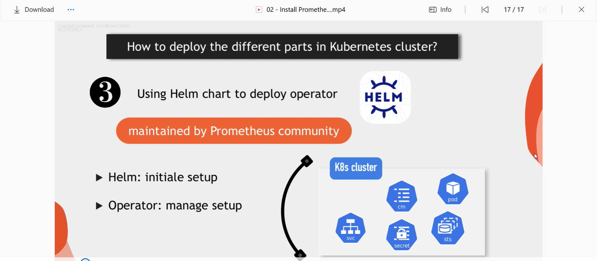
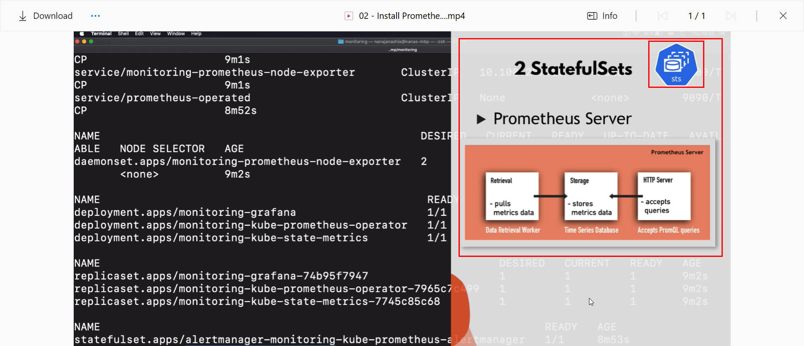
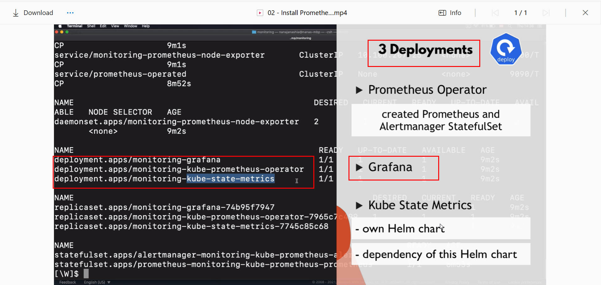
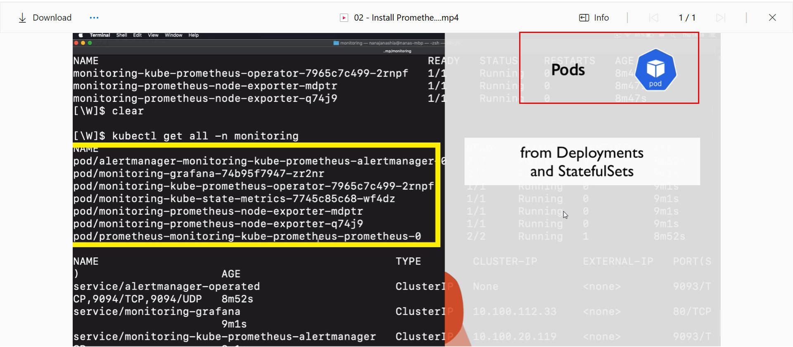
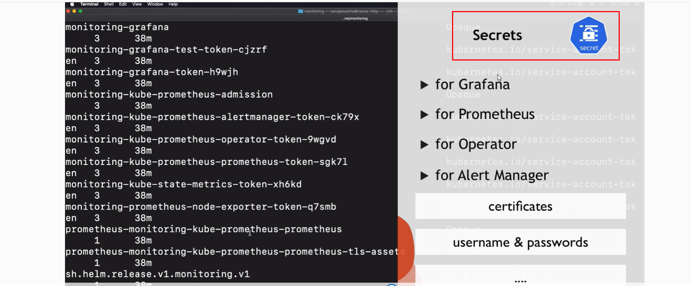

### **Setup Prometheus in EKS Cluster** 
## Setup a cluster in EKS and deploy prometheus in it.

There are several moving parts and components in prometheus monitoring stack. How do you go ahead deploying the various moving parts in a kubernetes cluster.
 There are various ways of doing this, which includes;

 1. Creating all configuration YAML files yourself and executing them in the right order.
 2. A more efficient way is **"using an Operator"**.
 Think of an operator as a manager of all individual prometheus components. Stateful sets and deployment for example will manage thier pod replicas; like restart them when they die, make sure they are accessible. 

 In this option, you will have to find an operator for promethues and deploy it in a cluster.
 
 3. The third an most efficient approach is to use the **HELM chart** to deploy the operator.
 Prometheus operator has a HELM chart that is maintained by the HELM Community. This is the option we will use to setup prometheus monitoring.
 in this approach,

 i.  HELM will do the initial setup
 
 II. Operator will manage the running prometheus setup

 

 ###  Demo Overview
 1. Create a Cluster in Amazon EKS
 2. Deploy a microservice application 
 3. Deploy prometheus monitoring stack that will monitor our kubernetes cluster.
 4. Monitor the microservices application in that kubernetes cluster.

 

 ## After deploying prometheus monitoring stack on our EKS cluster, Lets see what application got deployed that are part of the prometheus monitoring stack and what is the role of each application in the cluster so you know exactly what you are dealing with when you have prometheus stack running in your cluster.

 1. So we have two stateful sets (sts); the first one is prometheus itself. This is the actual core prometheus server based on the main image. which is goin to be managed by the operator.
 
 
 
 
 
 